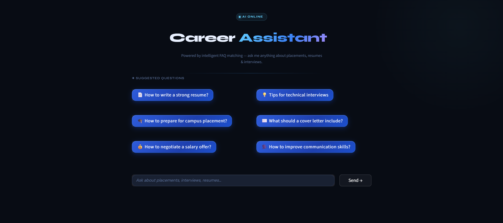
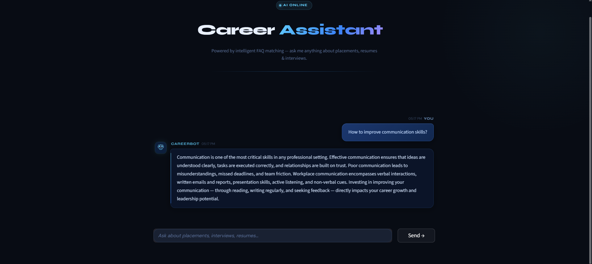
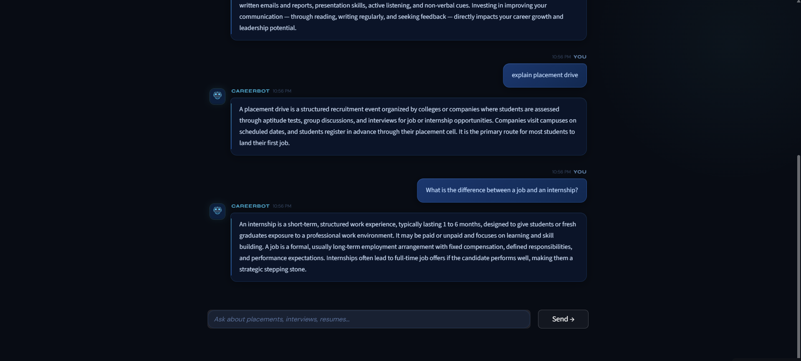
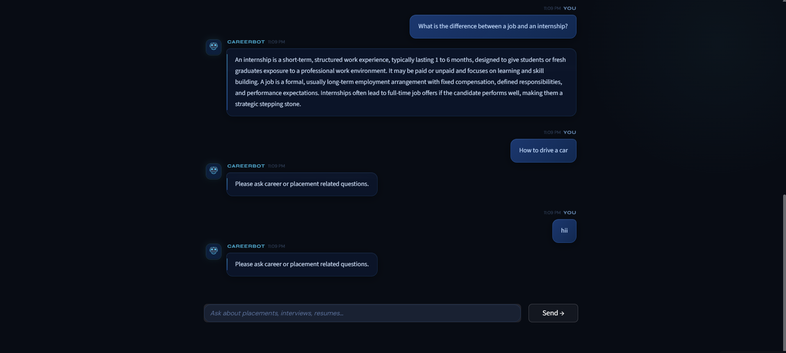

# CodeAlpha_FAQChatbot

## CareerBot AI Assistant 💼

An NLP-powered chatbot that provides intelligent answers to placement and career-related questions using semantic FAQ matching techniques.

## Features
- Smart FAQ matching using NLP
- TF-IDF vectorization
- Cosine similarity-based response retrieval
- Modern glassmorphism chatbot UI
- Suggested career questions
- Real-time chatbot responses
- Error handling for unrelated questions

## Tech Stack
- Python
- Streamlit
- Scikit-learn
- NLTK
- Pandas

## Screenshots


 


## Project Structure
CodeAlpha_FAQChatbot/
│
├── app.py
├── chatbot.py
├── styles.py
├── requirements.txt
├── placement_career_faqs.csv
├── README.md
└── .gitignore

## ⚙️ Installation & Setup

### Clone Repository
```bash
git clone https://github.com/Rutuja-VS/CodeAlpha_FAQChatBot.git
cd CodeAlpha_FAQChatbot
